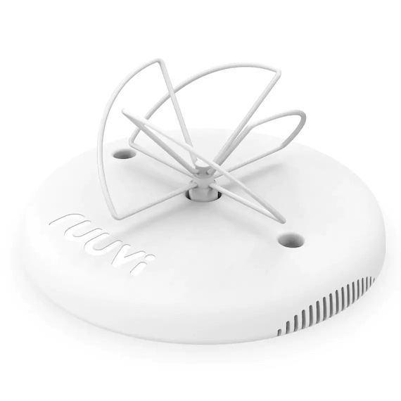

# Ruuvi Gateway MQTT JSON Parser

Parse Ruuvi Gateway JSON messages from MQTT broker and return them decoded back to the broker.

As does [@OH2MP](https://github.com/oh2mp/), I also am using Mosquitto as a broker and InfluxDB + Telegraf with Grafana. See [CONFIG_EXAMPLES.md](https://github.com/oh2mp/esp32_ble2mqtt/blob/main/CONFIG_EXAMPLES.md) from his project.

This script sends the decoded data as JSON to the broker and the dataformat is compatible with @OH2MP's [BLE2MQTT](https://github.com/oh2mp/esp32_ble2mqtt) project. See [DATAFORMATS.md](https://github.com/oh2mp/esp32_ble2mqtt/blob/main/DATAFORMATS.md)

## Supported BLE beacons

- [Ruuvi tag](https://ruuvi.com/) (Data format V5 aka RAWv2 only)

More to be supported eventually. Goal is to support the same as OH2MP ESP32 BLE2MQTT

## Hardware prerequisites



- [Ruuvi Gateway](https://ruuvi.com/)

## Software prerequisites

- Some MQTT broker like Mosquitto running somewhere.
- Perl libraries Net::MQTT::Simple, JSON::PP, Async::Event::Interval

## Configure the Ruuvi Gateway

- Open the Ruuvi Gateway configuration portal and go to Cloud Options page
- Select the custom HTTP/MQTT option from Advance settings
- (Optional) set HTTP(S) Server to the default Ruuvi Cloud address to send the data to the cloud.
- Select MQTT(S) and configure your MQTT server information.
- Topic prefix should be as ruuvi/<GW_MAC_ADDRESS>/<SENSOR_MAC_ADDRESS>, tick the first two options. Parsing the topic for this scripts configuration depends on it.

## Configuring the script

Two files are needed for the script config.txt and known_tags.txt. Both files are TAB separated lists. Sample configuration files are in the sample directory. Copy them to the source root directory and edit them to your needs.

### config.txt

```text
mqtthost    mqtt.server.com:1883
username    mqttuser
password    SecretPasswordForMQTT
sub_topic   ruuvi/+/#
pub_topic   ruuvi/decoded
pub_inter   60
```

Note! the password is not encrypted and is sent in the clear as SSL is not implemented for now.

### known_tags.txt

```text
ee:b4:25:31:cd:52   vaasanrinne7/ulko
ec:ee:96:87:ce:fc   vaasanrinne7/sisä
f8:30:99:04:9c:cd   vaasanrinne7/sauna
ec:b1:3e:0b:17:4f   vaasanrinne7/pakastin
d7:a0:8f:0f:55:2d   vaasanrinne7/jääkaappi
fa:99:df:0f:c6:70   vaasanrinne7/terassi
c1:ea:33:8d:78:3f   goa753/ulko
c5:35:43:fd:63:2a   goa753/sisä
f5:ae:63:b0:4d:3a   goa753/jääkaappi
```

Only the known tags are reported back to the broker with the matching name added to the pub_topic from config.txt.

# Sample data on the broker

## The raw JSON message from the gateway

```text
ruuvi/CA:56:56:28:2D:3C/C3:32:96:A8:2A:06 = {
 "gw_mac": "CA:56:56:28:2D:3C",
 "rssi": -60,
 "aoa": [],
 "gwts": "1667194334",
 "ts": "1667194334",
 "data": "0201061BFF990405004D74EDCA130408FE24FFE882161F69DEC33296A82A06",
 "coords": ""
}
```

## The decoded JSON messages sent back to the broker

```text
ruuvi/decoded/vaasanrinne7/sauna {"type":1,"t":184,"rh":32,"bu":2905,"ap":1011,"s":-88}
ruuvi/decoded/vaasanrinne7/terassi {"type":1,"t":211,"rh":29,"bu":2989,"ap":1011,"s":-87}
ruuvi/decoded/vaasanrinne7/sisä {"type":1,"t":204,"rh":31,"bu":2971,"ap":1010,"s":-75}
```

# Disclaimer

Thi script is based on my personal needs and has only been tested based on that.

# Thanks

- [@OH2MP](https://github.com/oh2mp/) for the ESP32 based BLE2MQTT project and dataformats
- [@Ruuvi](https://ruuvi.com) for creating the Ruuvi Tags and Ruuvi Gateway
